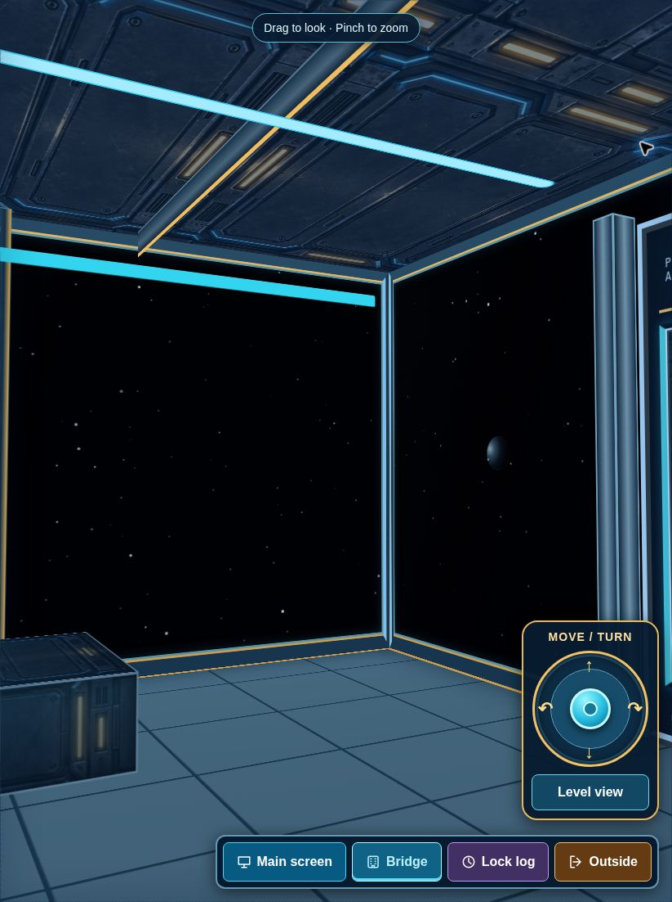

# StoreWell live verification — September 14, 2026

Production: https://storewell-3d.pages.dev/

Verified application commit: `6b95aa98b908342772972d686a082257ef2fc895`.
Cloudflare confirmed production deployment `f9523e2c-7011-4678-bb13-616240610c5a` as successful. GitHub run `34837646181` passed. The deployment retained all four custom character assets.

## Delivered

- Preserved the existing navy, cyan and gold bridge, furniture, screens, compact button menus, bottom-right joystick and sliding exit.
- Replaced the exterior imagery with one continuous, predominantly black, drifting starfield. Small distant planets, systems and occasional meteor trails pass through adjoining observation panes.
- Fixed the blank rear wall and missing door paint at the reproducible position x=0, z=10, yaw=-3.136, pitch=0.04. Merely changing backface rules, camera nesting, frustum culling or compositing hints did not solve it. The final implementation crops and projects each existing HTML face onto a flat layer and determines occlusion from overlapping face depths. Do not restore the former shared CSS3D camera layer without repeating the rear-view test.

## Actual production browser interactions

These checks used real browser clicks, drags, scrolling and screenshots after deployment, independently of the build checks. The browser viewport was 823 × 1102. The cloud browser did not provide WebGL; the exterior used the existing property-plan fallback.

| Check | Observed result |
| --- | --- |
| Room appearance | Front, rear and both aft corners rendered the original room with visible black observation glass; the previously blank rear angle now showed the door and stars. |
| Moving sky | Watched a planet move across adjoining panes without changing the camera, and captured a visible meteor trail on the final release. |
| Walking | Joystick moved down the aisle from z=10 to z=3.87; backwards movement returned to z=6.37. |
| Zoom | Actual wheel gestures changed zoom 1 → 1.35 → 1. Phone two-finger gestures were not tested. |
| Sliding exit | Clicked the closed door, observed opening then open, with opposite leaf translations. Walked from z=13.5 through z=19.33 to z=23.92; crossing the doorway returned outside. |
| Entry and session | Re-entered the bridge repeatedly without another sign-in; the command menu identified Kevin. |
| Board controls | Main screen focus and Bridge reset worked. All eight status buttons opened readable menus and closed successfully. Counts: Rented 135; out of service 0; locked out 24; lock on 0; lock off 2; reserved 2; no lock 0; ready 3. |
| Search and detail | Total units opened inventory; searching G2 returned its detail. Back preserved G2 in the search box. |
| Routes | Lock-on route correctly showed no matching units. Lock-off route selected 22, Next highlighted 23, and Done returned to the bridge. |
| History | Lock-log shortcut, full history and Refresh history loaded 214 saved changes. |
| Staff menus | Opened Activity log, Team, Stats, Units, Staff chat, My character, Player controls, Rounds checklist, Help and installation instructions. Back, Done and Close returned correctly. |
| Sound preference | Toggled On → Muted → On and restored On. Audio output itself was not measured. |
| Player controls | Opened and saved the unchanged settings. |
| Rounds | Displayed no Lock It units and Lock Off units 22 and 23. |
| Report menu | Opened Save & report and Staff report; recipient choices loaded and zero session changes left Send report disabled. No report was sent or saved. |
| Inventory download | Clicked Download inventory on the live site. The resulting CSV contained 166 rows and Unit, Size, Status columns. Browser download-event reporting timed out, but the actual downloaded file was verified. |
| Other navigation | Outside and Turn around outside returned to the property, with re-entry still working. |

## Remaining limits

- The external custom-character builder did not connect. Its failure message, Back to character choices and Done worked; the existing StoreWell character choices remained available.
- This browser denied notification permission. The alert control displayed the browser-settings guidance; delivery was not tested.
- Native phone pinch, Android GPU rendering/performance, app installation, full-screen behavior, printing and physical audio output still require device verification. Full screen was clicked but entry into full screen was not confirmed.
- No real unit status, contact, staff account, report, chat message or notification was changed/sent for testing. Switch staff member was left untouched to preserve the signed-in session. Production data writes and outbound delivery are not claimed as live-tested.
- Node 24 dependency installation and required builds passed; the repository checks intercepted production network mutations. Those checks are not substitutes for the browser interactions above.

